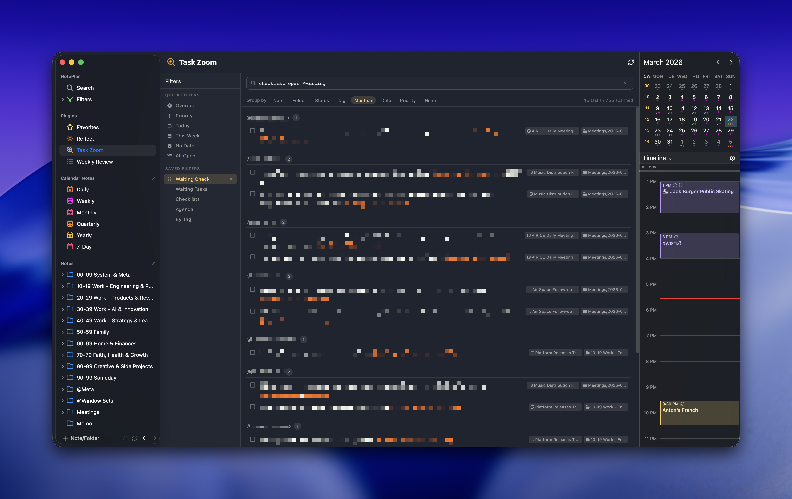

# Task Zoom for NotePlan

A powerful task filtering and browsing plugin for [NotePlan](https://noteplan.co), inspired by Todoist's filter syntax. Quickly find, group, and act on tasks across your entire vault from a single sidebar view.



## Features

- **Todoist-like query syntax** — filter tasks using natural expressions like `open overdue`, `#waiting`, `@person`, `p1`, `no date`, and combine them with `AND`, `OR`, `NOT`
- **Multiple grouping modes** — group results by Note, Folder, Status, Tag, Mention, Date, Priority, or None
- **Saved filters** — save your frequently-used queries for one-click access; per-filter grouping preferences are remembered
- **Quick filters** — built-in presets for Overdue, Priority, Today, This Week, No Date, and All Open
- **Task actions** — complete, cancel, cycle priority, schedule (today/tomorrow/this week/next week/custom date), and navigate to the source note
- **Calendar note support** — scans both project notes and calendar notes (daily, weekly, monthly, quarterly, yearly); tasks in calendar notes inherit their scheduled date from the note
- **Checklist support** — use the `checklist` keyword to filter checklist items (`+`) instead of tasks (`*`/`-`)
- **Assign mentions** — assign a task to a person via `@mention` dropdown, converting it to a checklist item
- **Visual enhancements** — hashtags and mentions highlighted in orange, overdue dates in red, today's dates in orange, priority badges, markdown rendering (bold, italic, code, links, strikethrough)
- **Mobile-friendly** — responsive layout with collapsible sidebar and touch-friendly controls
- **Light and dark theme** — adapts to NotePlan's current theme automatically
- **Filter reordering** — drag-and-drop to reorder saved filters in the sidebar

## Query Syntax

| Token | Meaning |
|-------|---------|
| `open` / `done` / `cancelled` | Filter by task status |
| `#tag` | Tasks containing a specific hashtag |
| `@mention` | Tasks containing a specific mention |
| `p1` / `p2` / `p3` | Priority (p1 = highest `!!!`, p2 = `!!`, p3 = `!`) |
| `overdue` | Tasks with a date before today |
| `today` | Tasks scheduled for today |
| `this week` / `next week` | Date range filters |
| `no date` | Tasks without any scheduled date |
| `folder:Name` | Tasks in a specific folder |
| `note:Name` | Tasks in a specific note |
| `checklist` | Search checklist items instead of tasks |
| `#` | Any task with at least one hashtag |
| `AND` / `OR` / `NOT` / `!` | Logical combinators |

Examples:
- `open overdue` — all open tasks past their due date
- `open p1 OR open p2` — high priority open tasks
- `open #waiting NOT @me` — waiting tasks not assigned to me
- `checklist open #project` — open checklist items tagged #project

## Installation

1. Copy the `asktru.TaskZoom` folder into your NotePlan plugins directory:
   ```
   ~/Library/Containers/co.noteplan.NotePlan*/Data/Library/Application Support/co.noteplan.NotePlan*/Plugins/
   ```
2. Restart NotePlan
3. Task Zoom appears in the sidebar under Plugins

## Settings

- **Folders to Exclude** — comma-separated folder names to skip when scanning (e.g., `@Archive, @Templates`)
- **Default Group By** — initial grouping mode (note, folder, status, tag, mention, date, priority, none)
- **Show Completed Tasks** — whether to include completed/cancelled tasks in results

## License

MIT
